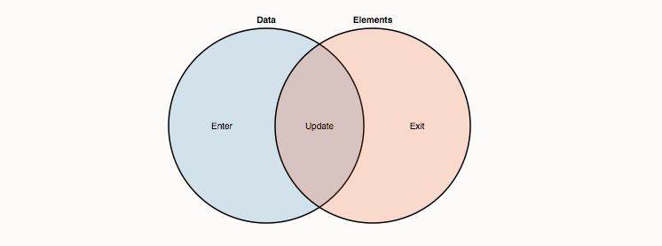

# selectAll, enter and join

Say you’re making a basic scatterplot using [D3](https://d3js.org/), and you need to create some [SVG circle](http://www.w3.org/TR/SVG/shapes.html#CircleElement) elements to visualize your data. You may be surprised to discover that D3 has no primitive for creating multiple DOM elements. Wait, [**WAT?**](https://www.destroyallsoftware.com/talks/wat)

Sure, there’s the [append](https://github.com/d3/d3/wiki/Selections#wiki-append) method, which you can use to create a single element.Here `svg` refers to a single-element selection containing an `<svg>` element created previously \(or selected from the current page, say\).

```text
svg.append("circle")
    .attr("cx", d.x)
    .attr("cy", d.y)
    .attr("r", 2.5);
```

But that’s just a single circle, and you want many circles: one for each data point. Before you bust out a `for` loop and brute-force it, consider this mystifying sequence from one of D3’s examples.Here `data` is an array of JSON objects with `x` and `y` properties, such as: `[{"x": 1.0, "y":1.1}, {"x": 2.0, "y":2.5}, …]`.

```text
svg.selectAll("circle")
  .data(data)
  .enter().append("circle")
    .attr("cx", function(d) { return d.x; })
    .attr("cy", function(d) { return d.y; })
    .attr("r", 2.5);
```

This code does exactly what you need: it creates a circle element for each data point, using the `x` and `y` data properties for positioning. But what’s with the `selectAll("circle")`? Why do you have to select elements that you know don’t exist in order to create new ones? WAT.

Here’s the deal. Instead of telling D3 how to do something, tell D3 what you want. You want the circle elements to correspond to data. You want one circle per datum. Instead of instructing D3 to create circles, then, tell D3 that the selection `"circle"` should correspond to data. This concept is called the data join:



Data points joined to existing elements produce the update \(inner\) selection. Leftover unbound data produce the enter selection \(left\), which represents missing elements. Likewise, any remaining unbound elements produce the exit selection \(right\), which represents elements to be removed.

Now we can unravel the mysterious enter-append sequence through the data join:

1. First, `svg.selectAll("circle")` returns a new empty selection, since the SVG container was empty. The parent node of this selection is the SVG container.
2. This selection is then joined to an array of data, resulting in three new selections that represent the three possible states: enter, update, and exit. Since the selection was empty, the update and exit selections are empty, while the enter selection contains a placeholder for each new datum.
3. The update selection is returned by [selection.data](https://github.com/d3/d3-selection/blob/master/README.md#selection_data), while the enter and exit selections hang off the update selection; [selection.enter](https://github.com/d3/d3-selection/blob/master/README.md#selection_enter) thus returns the enter selection.
4. The missing elements are added to the SVG container by calling [selection.append](https://github.com/d3/d3-selection/blob/master/README.md#selection_append) on the enter selection. This appends a new circle for each data point to the SVG container.

Thinking with joins means declaring a relationship between a selection \(such as `"circle"`\) and data, and then implementing this relationship through the three enter, update and exit states.

But why all the trouble? Why not just a primitive to create multiple elements? The beauty of the data join is that it generalizes. While the above code only handles the enter selection, which is sufficient for static visualizations, you can extend it to support [dynamic](https://bost.ocks.org/mike/miserables/) [visualizations](http://bl.ocks.org/mbostock/4062085) with only minor modifications for update and exit. And that means you can visualize [realtime data](https://bost.ocks.org/mike/path/), allow [interactive exploration](http://bl.ocks.org/mbostock/4063663), and [transition smoothly](http://bl.ocks.org/mbostock/1256572) between datasets!

Here’s an example of handling all three states:

```text
var circle = svg.selectAll("circle")
  .data(data);

circle.exit().remove();

circle.enter().append("circle")
    .attr("r", 2.5)
  .merge(circle)
    .attr("cx", function(d) { return d.x; })
    .attr("cy", function(d) { return d.y; });
```

To control how data is assign­ed to elements, you can pro­vide a [key function](https://bost.ocks.org/mike/constancy/).

Whenever this code is run, it recomputes the data join and maintains the desired correspondence between elements and data. If the new dataset is smaller than the old one, the surplus elements end up in the exit selection and get removed. If the new dataset is larger, the surplus data ends up in the enter selection and new nodes are added. If the new dataset is exactly the same size, then all the elements are simply updated with new positions, and no elements are added or removed.

Thinking with joins means your code is more declarative: you handle these three states without any branching \(`if`\) or iteration \(`for`\). Instead you describe how elements should correspond to data. If a given enter, update or exit selection happens to be empty, the corresponding code is a no-op.

Joins also let you target operations to specific states, if needed. For example, you can set constant attributes \(such as the circle’s radius, defined by the `"r"` attribute\) on enter rather than update. By reselecting elements and minimizing DOM changes, you vastly improve rendering performance! Similarly, you can target animated transitions to specific states. For example, for entering circles to expand-in:

```text
circle.enter().append("circle")
    .attr("r", 0)
  .transition()
    .attr("r", 2.5);
```

Likewise, to shrink-out:

```text
circle.exit().transition()
    .attr("r", 0)
    .remove();
```

Now you’re thinking with joins!

