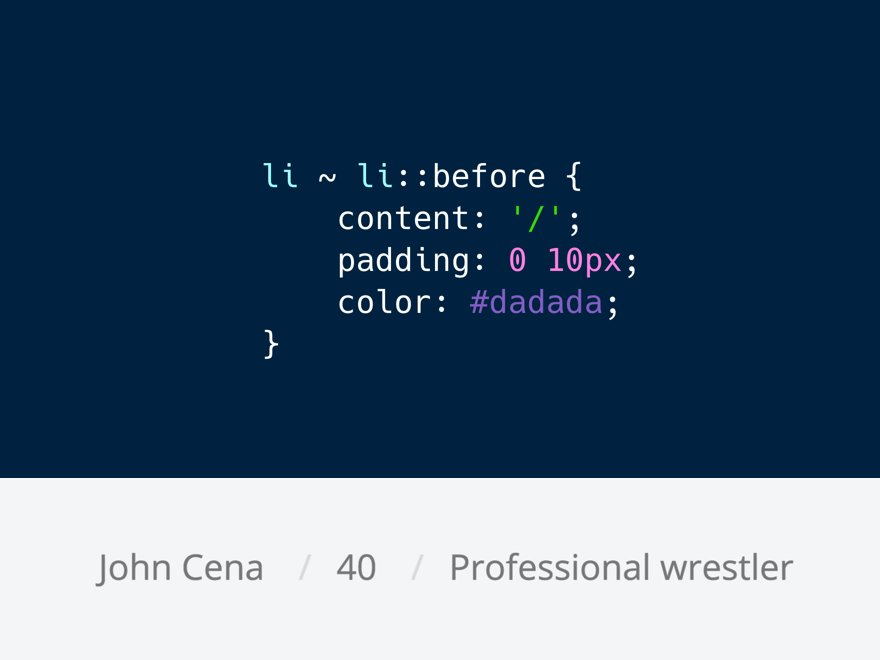

# CSS selector tips & tricks

## Add delimiters between elements

The "general sibling combinator" \(~\) in CSS is super handy to add delimiters between elements. No more :first-child/:last-child to remove leading or trailing delimiters

[https://twitter.com/DaniStefanovic/status/946646711291777024](https://twitter.com/DaniStefanovic/status/946646711291777024)

