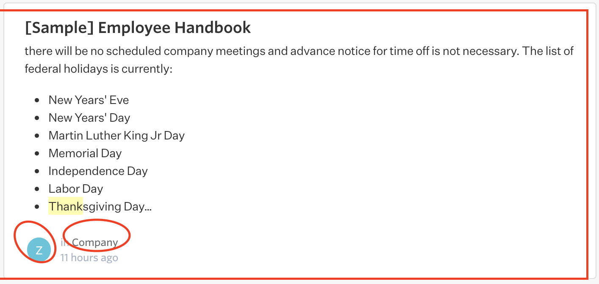
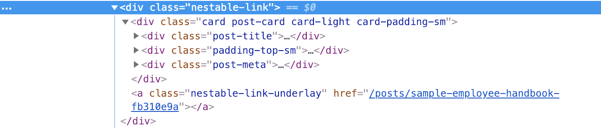

# Link contains links issue

Sometimes it is unavoidable to have a block with nested links like following:

```markup
<a>
    <h3>...</h3>
    <p>...</p>
    <div>... <a>...</a></div>
    <a>...</a>
</a>
```



The above markup structure will definitely not be acceptable by HTML standard. If we try to alter the child `a` tags with other tags like `span` and bind click, keypress events, that is tedious and how about handling accessibility and hover state?. The simpler solution is to absolutely position the parent `a` tag:

```markup
<div>
    <div>
        <h3>...</h3>
        <p>...</p>
        <div>... <a>...</a></div>
        <a>...</a>
    </div>
    <a absolute>....</a>
</div>
```



