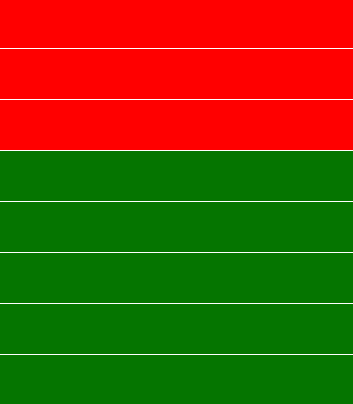
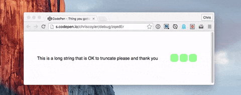

# CSS

## Select first n element from list

```css
.list div{
  background-color:green;
  height: 50px;
  margin-top:1px;
}
// turn background of first 3 divs to red
.list div:nth-child(-n + 3){
  background-color: red;
}
```



## Get rid of extra space below svg in div element

```markup
<div style="background-color: red;">
  <svg height="100px" width="100" style="background-color: blue;"></svg>
</div>
```

^ will leave a white-space below the `svg`. To get rid of the space you need `display: block;` on your `svg`.

```markup
<svg style="display: block;"></svg>
```

This is because inline-block elements \(like `<svg>` and ``\) sit on the text baseline. The extra space you are seeing is the space left to accommodate character descenders \(the tail on 'y', 'g' etc\).

You can also use `vertical-align:top` if you need to keep it `inline` or `inline-block`

## Prevent scaling block from changing its inside number



## Responsive Text Truncation



```css
  white-space: nowrap;
  overflow: hidden;
  text-overflow: ellipsis;
```

