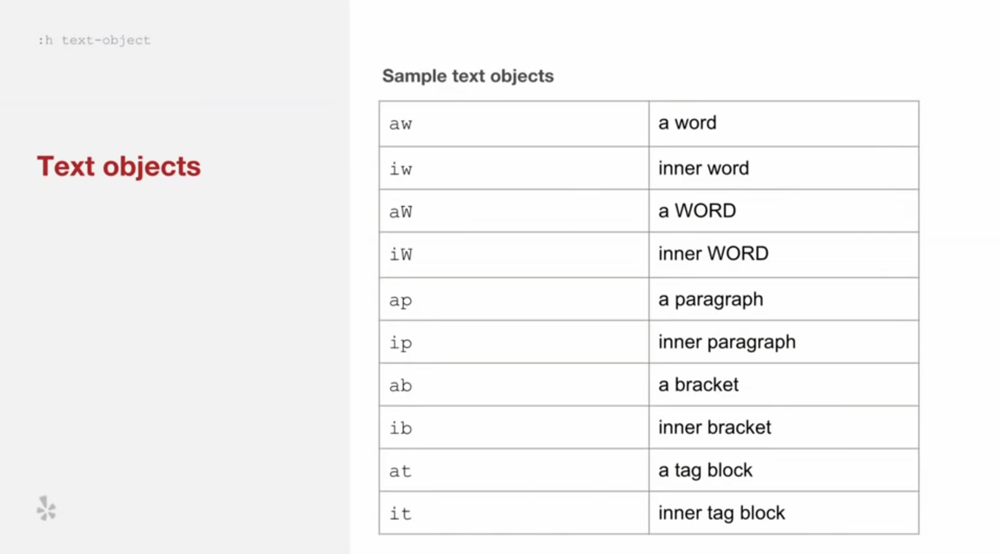
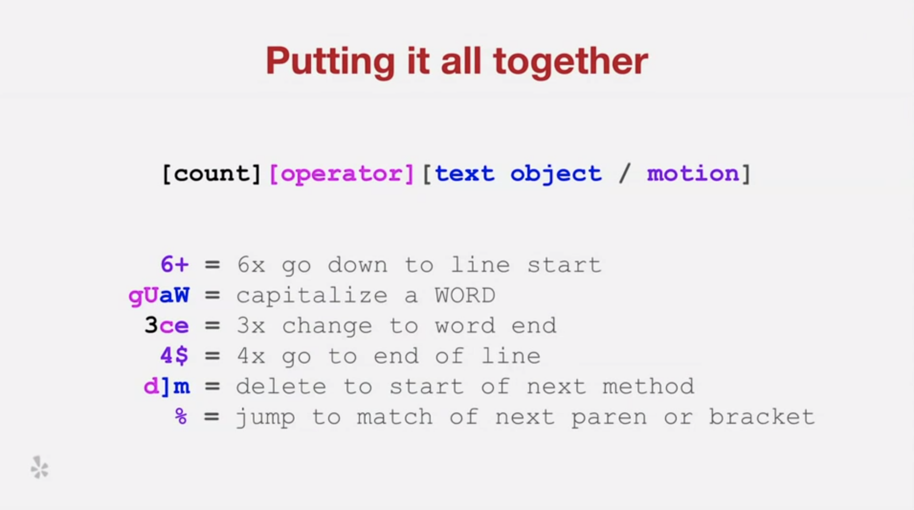
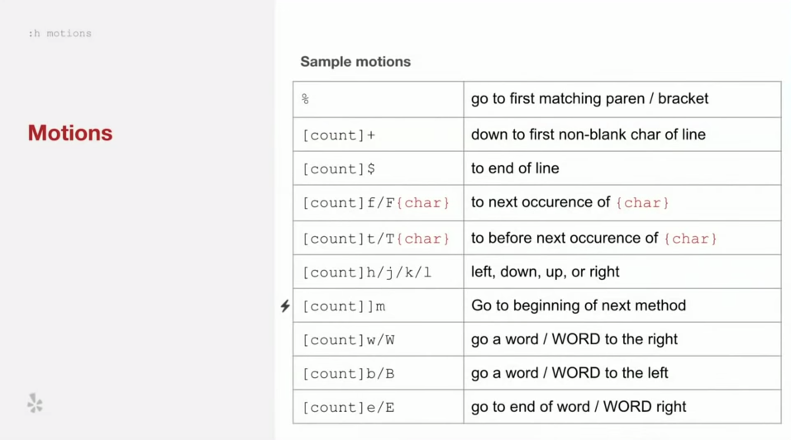
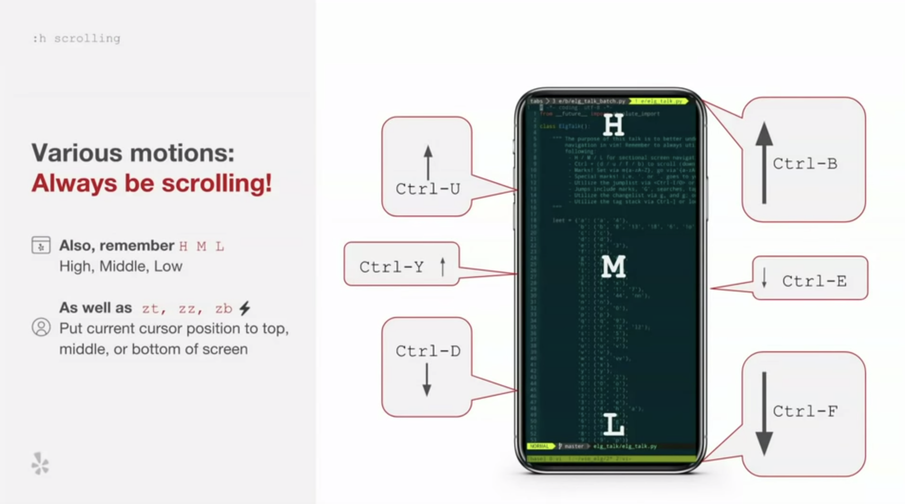
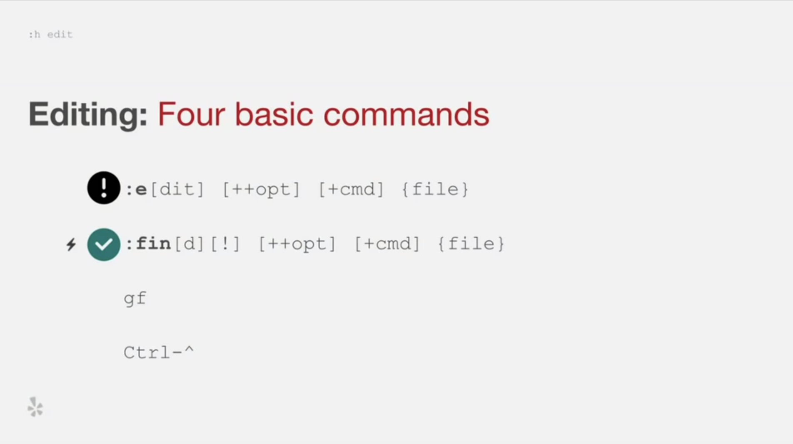
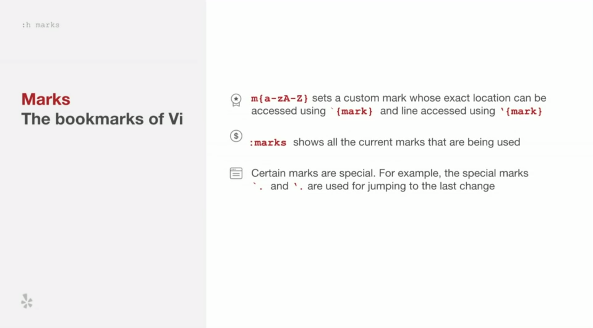
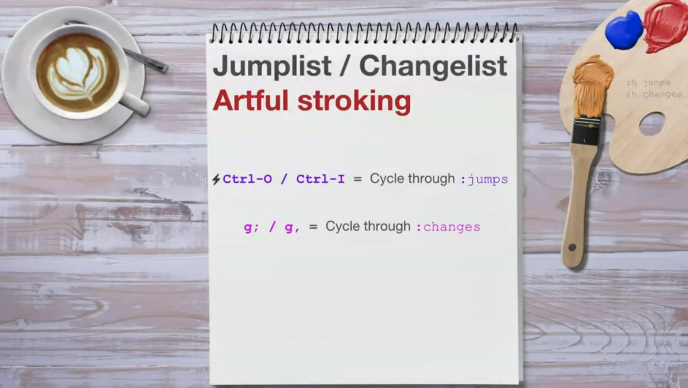
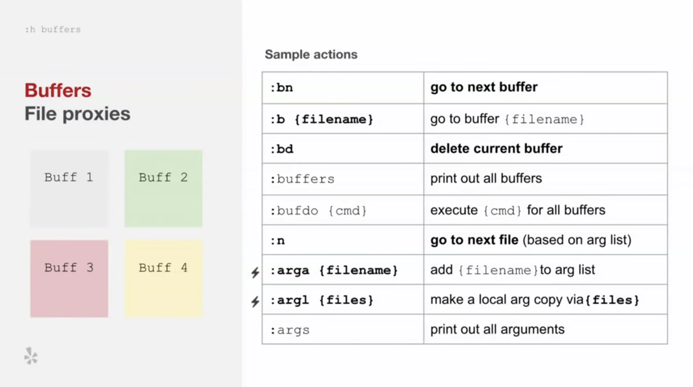
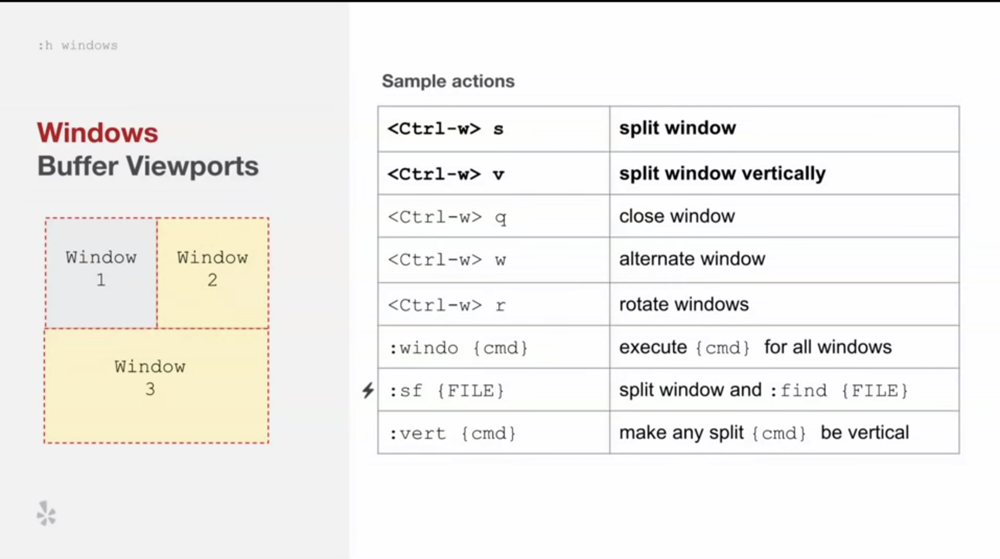
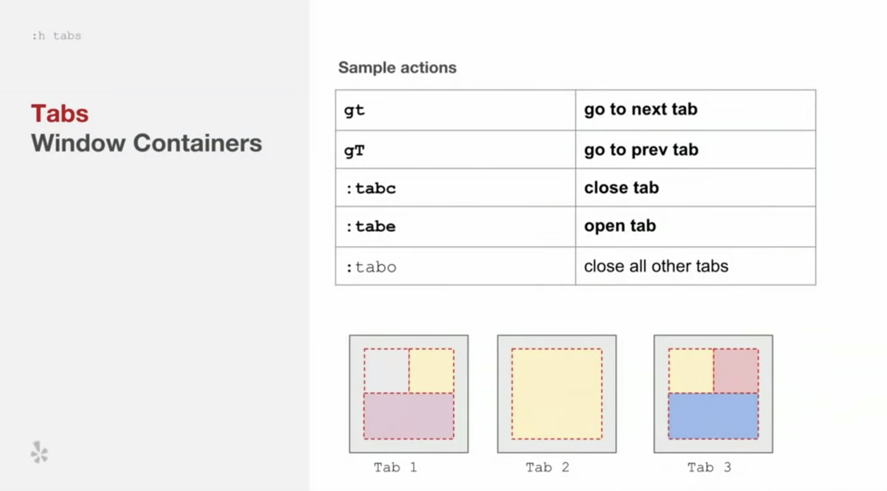

# Vim

## Mouseless with vim

























## Move line\(s\) up and down with ALT+jk

```bash
nnoremap ª :m .+1<CR>==
nnoremap º :m .-2<CR>==

inoremap ª <Esc>:m .+1<CR>==gi
inoremap º <Esc>:m .-2<CR>==gi

vnoremap ª :m '>+1<CR>gv=gv
vnoremap º :m '<-2<CR>gv=gv
```



